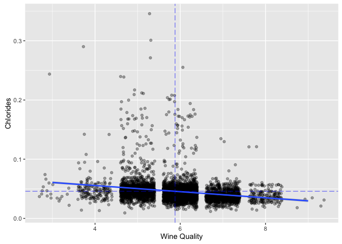

# Introduction
##### Citation Request:
This dataset is public available for research. The details are described in [Cortez et al., 2009]. 

  P. Cortez, A. Cerdeira, F. Almeida, T. Matos and J. Reis. 
  Modeling wine preferences by data mining from physicochemical properties.
  In Decision Support Systems, Elsevier, 47(4):547-553. ISSN: 0167-9236.

  Available at: [@Elsevier] http://dx.doi.org/10.1016/j.dss.2009.05.016
                [Pre-press (pdf)] http://www3.dsi.uminho.pt/pcortez/winequality09.pdf
                [bib] http://www3.dsi.uminho.pt/pcortez/dss09.bib

1. Title: Wine Quality 

2. Sources
   Created by: Paulo Cortez (Univ. Minho), Antonio Cerdeira, Fernando Almeida, Telmo Matos and Jose Reis (CVRVV) @ 2009
   
3. Past Usage:

  P. Cortez, A. Cerdeira, F. Almeida, T. Matos and J. Reis. 
  Modeling wine preferences by data mining from physicochemical properties.
  In Decision Support Systems, Elsevier, 47(4):547-553. ISSN: 0167-9236.

  In the above reference, two datasets were created, using red and white wine samples.
  The inputs include objective tests (e.g. PH values) and the output is based on sensory data
  (median of at least 3 evaluations made by wine experts). Each expert graded the wine quality 
  between 0 (very bad) and 10 (very excellent). Several data mining methods were applied to model
  these datasets under a regression approach. The support vector machine model achieved the
  best results. Several metrics were computed: MAD, confusion matrix for a fixed error tolerance (T),
  etc. Also, we plot the relative importances of the input variables (as measured by a sensitivity
  analysis procedure).
 
4. Relevant Information:

   The two datasets are related to red and white variants of the Portuguese "Vinho Verde" wine.
   For more details, consult: http://www.vinhoverde.pt/en/ or the reference [Cortez et al., 2009].
   Due to privacy and logistic issues, only physicochemical (inputs) and sensory (the output) variables 
   are available (e.g. there is no data about grape types, wine brand, wine selling price, etc.).

   These datasets can be viewed as classification or regression tasks.
   The classes are ordered and not balanced (e.g. there are munch more normal wines than
   excellent or poor ones). Outlier detection algorithms could be used to detect the few excellent
   or poor wines. Also, we are not sure if all input variables are relevant. So
   it could be interesting to test feature selection methods. 

5. Number of Instances: red wine - 1599; white wine - 4898. 

6. Number of Attributes: 11 + output attribute
  
   Note: several of the attributes may be correlated, thus it makes sense to apply some sort of
   feature selection.

7. Attribute information:
   + fixed acidity (tartaric acid - g / dm^3)
   + volatile acidity (acetic acid - g / dm^3)
   + citric acid (g / dm^3)
   + residual sugar (g / dm^3)
   + chlorides (sodium chloride - g / dm^3
   + free sulfur dioxide (mg / dm^3)
   + total sulfur dioxide (mg / dm^3)
   + density (g / cm^3)
   + pH
   + sulphates (potassium sulphate - g / dm3)
   + alcohol (% by volume)
   + quality (score between 0 and 10)

   For more information, read [Cortez et al., 2009].
   
8. Missing Attribute Values: None

9. Description of attributes:

 + 1-11: Input variables (based on physicochemical tests)
 + 12: Output variable (based on sensory data):
 
   1 - fixed acidity: most acids involved with wine or fixed or nonvolatile (do not evaporate readily)

   2 - volatile acidity: the amount of acetic acid in wine, which at too high of levels can lead to an unpleasant, vinegar taste

   3 - citric acid: found in small quantities, citric acid can add 'freshness' and flavor to wines

   4 - residual sugar: the amount of sugar remaining after fermentation stops, it's rare to find wines with less than 1 gram/liter and wines with greater than 45 grams/liter are considered sweet

   5 - chlorides: the amount of salt in the wine

   6 - free sulfur dioxide: the free form of SO2 exists in equilibrium between molecular SO2 (as a dissolved gas) and bisulfite ion; it prevents microbial growth and the oxidation of wine

   7 - total sulfur dioxide: amount of free and bound forms of S02; in low concentrations, SO2 is mostly undetectable in wine, but at free SO2 concentrations over 50 ppm, SO2 becomes evident in the nose and taste of wine

   8 - density: the density of water is close to that of water depending on the percent alcohol and sugar content

   9 - pH: describes how acidic or basic a wine is on a scale from 0 (very acidic) to 14 (very basic); most wines are between 3-4 on the pH scale

   10 - sulphates: a wine additive which can contribute to sulfur dioxide gas (S02) levels, wich acts as an antimicrobial and antioxidant

   11 - alcohol: the percent alcohol content of the wine

   12 - quality (score between 0 and 10)


***
# Data exploration
## Import Data
Notes:
First, load all of the necessary packages and librarys needed to make the analysis.


```r
# Import librarys
library(ggplot2)
```

Note:
Load the dataset for white wines in a data frame.


```r
# Check Working Directory
getwd()
```

```
## [1] "/Users/merongoitom/Desktop/Nanodegree/R/Project/ProjectSubmission"
```

```r
# Set Working Directory
setwd('/Users/merongoitom/Desktop/Nanodegree/R/Project/Data')

# Import CSV File
wq = read.csv("wineQualityWhites.csv")
```

***

## Unraveling data
Notes:
Let's run some basic functions to examine the structure and schema of the data set.

```r
# Nr observations
dim(wq)[1]
```

```
## [1] 4898
```

```r
# Nr variables
dim(wq)[2]
```

```
## [1] 13
```

```r
# Check vairable names
names(wq)
```

```
##  [1] "X"                    "fixed.acidity"        "volatile.acidity"    
##  [4] "citric.acid"          "residual.sugar"       "chlorides"           
##  [7] "free.sulfur.dioxide"  "total.sulfur.dioxide" "density"             
## [10] "pH"                   "sulphates"            "alcohol"             
## [13] "quality"
```

```r
# Check top three stats for each variable
head(wq[,2:13],3)
```

```
##   fixed.acidity volatile.acidity citric.acid residual.sugar chlorides
## 1           7.0             0.27        0.36           20.7     0.045
## 2           6.3             0.30        0.34            1.6     0.049
## 3           8.1             0.28        0.40            6.9     0.050
##   free.sulfur.dioxide total.sulfur.dioxide density   pH sulphates alcohol
## 1                  45                  170  1.0010 3.00      0.45     8.8
## 2                  14                  132  0.9940 3.30      0.49     9.5
## 3                  30                   97  0.9951 3.26      0.44    10.1
##   quality
## 1       6
## 2       6
## 3       6
```

```r
# See summary data
summary(wq)
```

```
##        X        fixed.acidity    volatile.acidity  citric.acid    
##  Min.   :   1   Min.   : 3.800   Min.   :0.0800   Min.   :0.0000  
##  1st Qu.:1225   1st Qu.: 6.300   1st Qu.:0.2100   1st Qu.:0.2700  
##  Median :2450   Median : 6.800   Median :0.2600   Median :0.3200  
##  Mean   :2450   Mean   : 6.855   Mean   :0.2782   Mean   :0.3342  
##  3rd Qu.:3674   3rd Qu.: 7.300   3rd Qu.:0.3200   3rd Qu.:0.3900  
##  Max.   :4898   Max.   :14.200   Max.   :1.1000   Max.   :1.6600  
##  residual.sugar     chlorides       free.sulfur.dioxide
##  Min.   : 0.600   Min.   :0.00900   Min.   :  2.00     
##  1st Qu.: 1.700   1st Qu.:0.03600   1st Qu.: 23.00     
##  Median : 5.200   Median :0.04300   Median : 34.00     
##  Mean   : 6.391   Mean   :0.04577   Mean   : 35.31     
##  3rd Qu.: 9.900   3rd Qu.:0.05000   3rd Qu.: 46.00     
##  Max.   :65.800   Max.   :0.34600   Max.   :289.00     
##  total.sulfur.dioxide    density             pH          sulphates     
##  Min.   :  9.0        Min.   :0.9871   Min.   :2.720   Min.   :0.2200  
##  1st Qu.:108.0        1st Qu.:0.9917   1st Qu.:3.090   1st Qu.:0.4100  
##  Median :134.0        Median :0.9937   Median :3.180   Median :0.4700  
##  Mean   :138.4        Mean   :0.9940   Mean   :3.188   Mean   :0.4898  
##  3rd Qu.:167.0        3rd Qu.:0.9961   3rd Qu.:3.280   3rd Qu.:0.5500  
##  Max.   :440.0        Max.   :1.0390   Max.   :3.820   Max.   :1.0800  
##     alcohol         quality     
##  Min.   : 8.00   Min.   :3.000  
##  1st Qu.: 9.50   1st Qu.:5.000  
##  Median :10.40   Median :6.000  
##  Mean   :10.51   Mean   :5.878  
##  3rd Qu.:11.40   3rd Qu.:6.000  
##  Max.   :14.20   Max.   :9.000
```

```r
# Check data type
str(wq)
```

```
## 'data.frame':	4898 obs. of  13 variables:
##  $ X                   : int  1 2 3 4 5 6 7 8 9 10 ...
##  $ fixed.acidity       : num  7 6.3 8.1 7.2 7.2 8.1 6.2 7 6.3 8.1 ...
##  $ volatile.acidity    : num  0.27 0.3 0.28 0.23 0.23 0.28 0.32 0.27 0.3 0.22 ...
##  $ citric.acid         : num  0.36 0.34 0.4 0.32 0.32 0.4 0.16 0.36 0.34 0.43 ...
##  $ residual.sugar      : num  20.7 1.6 6.9 8.5 8.5 6.9 7 20.7 1.6 1.5 ...
##  $ chlorides           : num  0.045 0.049 0.05 0.058 0.058 0.05 0.045 0.045 0.049 0.044 ...
##  $ free.sulfur.dioxide : num  45 14 30 47 47 30 30 45 14 28 ...
##  $ total.sulfur.dioxide: num  170 132 97 186 186 97 136 170 132 129 ...
##  $ density             : num  1.001 0.994 0.995 0.996 0.996 ...
##  $ pH                  : num  3 3.3 3.26 3.19 3.19 3.26 3.18 3 3.3 3.22 ...
##  $ sulphates           : num  0.45 0.49 0.44 0.4 0.4 0.44 0.47 0.45 0.49 0.45 ...
##  $ alcohol             : num  8.8 9.5 10.1 9.9 9.9 10.1 9.6 8.8 9.5 11 ...
##  $ quality             : int  6 6 6 6 6 6 6 6 6 6 ...
```

Response:
This tidy data set contains 4898 observations with 12 variables and one indicating the wine ID X. All variables except wine quality are numeric. 

***

# Analysis

## Questions
  1. What is the quality of white wines that were tasted?
  2. Which chemical properties influence the quality of white wines?

## Wine Quality
Note: 
Exploring wine quality data

```r
# Summary of Wine Quality
summary(wq$quality)
```

```
##    Min. 1st Qu.  Median    Mean 3rd Qu.    Max. 
##   3.000   5.000   6.000   5.878   6.000   9.000
```

```r
# Saving min, max, mean, median and sd into a variable
wq_quality_min <- min(wq$quality)
wq_quality_max <- max(wq$quality)
wq_quality_mean <- mean(wq$quality)
wq_quality_median <- median(wq$quality)
wq_quality_sd = sd(wq$quality)
wq_quality_mode <- names(which.max(table(wq$quality)))

# Number of respondents to each ranking
table(wq$quality)
```

```
## 
##    3    4    5    6    7    8    9 
##   20  163 1457 2198  880  175    5
```

```r
# Format quality for later use
wq$quality.factor = factor(wq$quality, ordered=TRUE)
```
Response:
* The range of posible scores for wine quality are between 0 (very bad) and 10 (very good), in our dataset the minimum score is 3 (20ppl) and the maximum is 9 (5ppl). 
* The mean is 5.878 and the median is 6.000, very close to each other.
* The most given quality score is also 6.
* The standard diviation of white wine quality is 0.8856386 thus our distribution of wine quality scores is not very disperse


```r
# Interquartile range
wq_quality_iqr <- IQR(wq$quality)
wq_quality_q1 <- wq_quality_median - wq_quality_iqr
wq_quality_q3 <- wq_quality_median + wq_quality_iqr
```
Response:
The IQR = 1, with a median of 6 makes the IQR range between 5 and 7. 
The outliers can be counted through 1.5 $\times$ IQR. That is 5 - (1.5 $\times$ 1) = 3.5, 7 + (1.5 $\times$ 1) = 8.5. We could then consider any quality value of less than 3.5 or more than 8.5 an outlier.

Note: Check for outliers

```r
wq_outliers <- sum(wq$quality < wq_quality_q1 - 1.5*wq_quality_iqr)
wq_outliers <- wq_outliers + sum(wq$quality > wq_quality_q3 + 1.5*wq_quality_iqr)
wq_outliers
```

```
## [1] 25
```
Response:
This leavs us with 25 outliers.

Note:
Finally, lets visualize the results

```r
ggplot(data=wq, aes(x=quality)) +
    geom_bar(binwidth=1, color='black', fill='white') +
    scale_x_continuous(breaks = seq(2,10,1), lim = c(2,10)) +
    scale_y_sqrt() +
    geom_vline(xintercept = wq_quality_median, linetype='longdash', alpha=.5) +
    geom_vline(xintercept = wq_quality_q1 - 1.5*wq_quality_iqr, linetype='longdash', alpha=.5) +
    geom_vline(xintercept = wq_quality_q3 + 1.5*wq_quality_iqr, linetype='longdash', alpha=.5) +
    geom_vline(xintercept = wq_quality_mean, linetype=1, color='blue', alpha=.5) +
    xlab("Wine Quality") +
    ylab("Number of Samples")
```

```
## Warning: `geom_bar()` no longer has a `binwidth` parameter. Please use
## `geom_histogram()` instead.
```

<!-- -->

Response:
Much of this information can be seen using the 'summary' command. So if 6 is considered to be the average quality score in a 0 to 10 scale, then we can see in our plot that the majority of quality scores lie close to 6.

***

### Check correlatons
Notes: Let's check the correlation between quality and the other 12 variables in the data set.


```r
cor(x=wq[,2:12], y=wq$quality)
```

```
##                              [,1]
## fixed.acidity        -0.113662831
## volatile.acidity     -0.194722969
## citric.acid          -0.009209091
## residual.sugar       -0.097576829
## chlorides            -0.209934411
## free.sulfur.dioxide   0.008158067
## total.sulfur.dioxide -0.174737218
## density              -0.307123313
## pH                    0.099427246
## sulphates             0.053677877
## alcohol               0.435574715
```
Response:
From the code we find that alcohol, density and chlorides are the top three variables correlated with quality.

Lets make a closer inspection into the top 5 scores:

* alcohol               0.435574715
* density              -0.307123313
* chlorides            -0.209934411
* volatile.acidity     -0.194722969
* total.sulfur.dioxide -0.174737218

***

## Alcohol analysis

### Saving variables
Notes:
First, a quick summary of the differnet alcohol values.

```r
summary(wq$alcohol)
```

```
##    Min. 1st Qu.  Median    Mean 3rd Qu.    Max. 
##    8.00    9.50   10.40   10.51   11.40   14.20
```

```r
wq_alcohol_mean <- mean(wq$alcohol)
wq_alcohol_median <- median(wq$alcohol)
```

### Info on alcohol amount and wine quality
Notes:
The analysis of alcohol effect on wine quality will be done in two steps
1. First we will inspect how the alcohol values are distributed accross the different quality scores. 
2. Then we will analyse how they change together.

```r
tapply(wq$alcohol, wq$quality, mean)
```

```
##        3        4        5        6        7        8        9 
## 10.34500 10.15245  9.80884 10.57537 11.36794 11.63600 12.18000
```
Response:
This result give us the average alcohol level for each quality score

### Visualized boxplot alcohol amount and wine quality
Notes:
Using ggplot we can visualize, alcohol by quality level using boxplot, together with the median for the whole distribution and the mean for the quality scores.

```r
ggplot(data=wq, aes(x=quality.factor, y=alcohol)) +
    geom_boxplot() +
    geom_hline(show.legend=T, yintercept=wq_alcohol_mean, linetype='longdash', alpha=.5, color='blue') +
    geom_vline(xintercept = wq_quality_mean-wq_quality_min+1, linetype='longdash', color='blue', alpha=.5) +
    xlab("Wine Quality") +
    ylab("Alcohol")
```

<!-- -->

```r
mean(wq$alcohol)
```

```
## [1] 10.51427
```

Response:
The results show that scores beyond the mean quality value of 5.877909, has a higher alcohol level than 10.51427.

### Additional visualization scatterplot with linear regression line
Notes:
We can already make good assumptions on how alcohol effects the quality of wine but to make extra sure of the pattern we can use a scatter plot and include a linear regression line.


```r
ggplot(data=wq, aes(x=as.numeric(quality), y=alcohol)) +
    geom_jitter(alpha=1/3) +
    geom_smooth(method='lm', aes(group = 1))+
    geom_hline(yintercept=wq_alcohol_mean, linetype='longdash', alpha=.5, color='blue') +
    geom_vline(xintercept = wq_quality_mean, linetype='longdash', color='blue', alpha=.5) +
    xlab("Wine Quality") +
    ylab("Alcohol")
```

<!-- -->

Response:
My conclusion is that alcohol affects the quality of wine positively.

***

## Density analysis
Density has a small range between 0.99 to 1.04g/cc. It mostly depends on the percent of alcohol and sugar in the wine.

### Saving variables


```r
wq_density_mean = mean(wq$density)
```

### Info on density on wine quality

```r
summary(wq$density)
```

```
##    Min. 1st Qu.  Median    Mean 3rd Qu.    Max. 
##  0.9871  0.9917  0.9937  0.9940  0.9961  1.0390
```

```r
tapply(wq$density, wq$quality, mean)
```

```
##         3         4         5         6         7         8         9 
## 0.9948840 0.9942767 0.9952626 0.9939613 0.9924524 0.9922359 0.9914600
```
Response:
Density has a small range between 0.9871 to 1.0390g/cc. Density is said to depend on the amount of alcohol and suger in the water so let's calculate this correlation.

### Correlation between alcohol and density

```r
ggplot(data=wq, aes(x=alcohol, y=density)) +
    geom_jitter(alpha = 0.5, size = 0.75) +
  ggtitle('Alcohol vs. Density') +
  coord_cartesian(ylim = c(0.98, 1.01)) +
  geom_smooth(method = lm)+
  xlab("Alcohol") +
  ylab("Density")
```

<!-- -->

Response:
The plot above clearly shows that the density decreases when the amount of alcohol increases.

# Correlation between residual-sugar and density

```r
ggplot(data=wq, aes(x=as.numeric(residual.sugar), y=density)) +
    geom_jitter(alpha = 0.5, size = 0.75) +
    geom_smooth(method='lm', aes(group = 1))+
  coord_cartesian(xlim = c(0, 25), ylim = c(0.98, 1.01)) + 
    xlab("Residual Sugar") +
    ylab("Density")
```

<!-- -->

# Correlation between alcohol vs. density & residual-sugar vs. density

```r
cor(x=wq$alcohol, y=wq$density)
```

```
## [1] -0.7801376
```

```r
cor(x=wq$residual.sugar, y=wq$density)
```

```
## [1] 0.8389665
```

Response:
The plot above shows that density increases with residual sugar content. Residual sugar and alcohol explains muck of the variance in density. So to minimize multicullinearity i decide not to include density in the presence of alcohol or sugar in any modelling. 

***

## Chlorides analysis

### Saving variables
Notes:
Let's perform a similar analysis for Chlorides and volatile acidity as we did for alcohol.

```r
summary(wq$chlorides)
```

```
##    Min. 1st Qu.  Median    Mean 3rd Qu.    Max. 
## 0.00900 0.03600 0.04300 0.04577 0.05000 0.34600
```

```r
wq_chlorides_mean <- mean(wq$chlorides)
wq_chlorides_median <- median(wq$chlorides)
```

### Info on Chlorides amount and wine quality

```r
tapply(wq$chlorides, wq$quality, mean)
```

```
##          3          4          5          6          7          8 
## 0.05430000 0.05009816 0.05154633 0.04521747 0.03819091 0.03831429 
##          9 
## 0.02740000
```

### Visualized boxplot chlorides amount and wine quality


```r
ggplot(data=wq, aes(x=quality.factor, y=chlorides)) +
    geom_boxplot() +
    geom_hline(show.legend=T, yintercept=wq_chlorides_mean, linetype='longdash', alpha=.5, color='blue') +
    geom_vline(xintercept = wq_quality_mean-wq_quality_min+1, linetype='longdash', color='blue', alpha=.5) +
    xlab("Wine Quality") +
    ylab("Chlorides")
```

<!-- -->

### Additional visualization scatterplot with linear regression line

```r
ggplot(data=wq, aes(x=as.numeric(quality), y=chlorides)) +
    geom_jitter(alpha=1/3) +
    geom_smooth(method='lm', aes(group = 1))+
    geom_hline(yintercept=wq_chlorides_mean, linetype='longdash', alpha=.5, color='blue') +
    geom_vline(xintercept = wq_quality_mean, linetype='longdash', color='blue', alpha=.5) +
    xlab("Wine Quality") +
    ylab("Chlorides")
```

<!-- -->

Response:
My conclusion is that adding chlorides affects the quality of wine negatively.

***

## Volatile.acidity analysis

### Saving variables

```r
wq_volatile.acidity_mean = mean(wq$volatile.acidity)
```

### Info on volatile.acidity amount and wine quality

```r
summary(wq$volatile.acidity)
```

```
##    Min. 1st Qu.  Median    Mean 3rd Qu.    Max. 
##  0.0800  0.2100  0.2600  0.2782  0.3200  1.1000
```

```r
tapply(wq$volatile.acidity, wq$quality, mean)
```

```
##         3         4         5         6         7         8         9 
## 0.3332500 0.3812270 0.3020110 0.2605641 0.2627670 0.2774000 0.2980000
```

### Visualized boxplot volatile.acidity amount and wine quality

```r
ggplot(data=wq, aes(x=quality.factor, y=volatile.acidity)) +
    geom_boxplot() +
    geom_hline(show.legend=T, yintercept=wq_volatile.acidity_mean, linetype='longdash', alpha=.5, color='blue') +
    geom_vline(xintercept = wq_quality_mean-wq_quality_min+1, linetype='longdash', color='blue', alpha=.5) +
    xlab("Wine Quality") +
    ylab("Volatile Acidity")
```

<!-- -->

### Additional visualization scatterplot with linear regression line

```r
ggplot(data=wq, aes(x=as.numeric(quality), y=volatile.acidity)) +
    geom_jitter(alpha=1/3) +
    geom_smooth(method='lm', aes(group = 1))+
    geom_hline(yintercept=wq_volatile.acidity_mean, linetype='longdash', alpha=.5, color='blue') +
    geom_vline(xintercept = wq_quality_mean, linetype='longdash', color='blue', alpha=.5) +
    xlab("Wine Quality") +
    ylab("Volatile Acidity")
```

<!-- -->

Response:
On each plot we can see the negative effects of volatile acidity on a white wine's quality score.

***

## Total.sulfur.dioxide analysis

### Saving variables

```r
wq_total.sulfur.dioxide_mean = mean(wq$total.sulfur.dioxide)
```

### Info on Total.sulfur.dioxide amount and wine quality

```r
summary(wq$total.sulfur.dioxide)
```

```
##    Min. 1st Qu.  Median    Mean 3rd Qu.    Max. 
##     9.0   108.0   134.0   138.4   167.0   440.0
```

```r
tapply(wq$total.sulfur.dioxide, wq$quality, mean)
```

```
##        3        4        5        6        7        8        9 
## 170.6000 125.2791 150.9046 137.0473 125.1148 126.1657 116.0000
```

### Visualized boxplot alcohol amount and wine quality

```r
ggplot(data=wq, aes(x=quality.factor, y=total.sulfur.dioxide)) +
    geom_boxplot() +
    geom_hline(show.legend=T, yintercept=wq_total.sulfur.dioxide_mean, linetype='longdash', alpha=.5, color='blue') +
    geom_vline(xintercept = wq_quality_mean-wq_quality_min+1, linetype='longdash', color='blue', alpha=.5) +
    xlab("Wine Quality") +
    ylab("Total Sulfur Dioxide")
```

<!-- -->

### Additional visualization scatterplot with linear regression line

```r
ggplot(data=wq, aes(x=as.numeric(quality), y=total.sulfur.dioxide)) +
    geom_jitter(alpha=1/3) +
    geom_smooth(method='lm', aes(group = 1))+
    geom_hline(yintercept=wq_total.sulfur.dioxide_mean, linetype='longdash', alpha=.5, color='blue') +
    geom_vline(xintercept = wq_quality_mean, linetype='longdash', color='blue', alpha=.5) +
    xlab("Wine Quality") +
    ylab("Total Sulfur Dioxide")
```

<!-- -->

Response:
We can see that the variable total.sulfur.dioxide has a negative correlation to wine Quality.

***

#Final plots and summary

### Recalling our original questions:

1. What is the quality of white wines that were tasted?
2. Which chemical properties influence the quality of white wines?


## Plot One: White Wine Quality


```r
# Summary of Wine Quality
summary(wq$quality)
```

```
##    Min. 1st Qu.  Median    Mean 3rd Qu.    Max. 
##   3.000   5.000   6.000   5.878   6.000   9.000
```

```r
# Number of respondents to each ranking
table(wq$quality)
```

```
## 
##    3    4    5    6    7    8    9 
##   20  163 1457 2198  880  175    5
```

```r
# Plot rating distribution with histogram
ggplot(data=wq, aes(x=quality)) +
    geom_bar(binwidth=1, color='black', fill='white') +
    scale_x_continuous(breaks = seq(2,10,1), lim = c(2,10)) +
    scale_y_sqrt() +
    geom_vline(xintercept = wq_quality_median, linetype='longdash', alpha=.5) +
    geom_vline(xintercept = wq_quality_q1 - 1.5*wq_quality_iqr, linetype='longdash', alpha=.5) +
    geom_vline(xintercept = wq_quality_q3 + 1.5*wq_quality_iqr, linetype='longdash', alpha=.5) +
    geom_vline(xintercept = wq_quality_mean, linetype=1, color='blue', alpha=.5) +
    xlab("Wine Quality") +
    ylab("Number of Samples")
```

```
## Warning: `geom_bar()` no longer has a `binwidth` parameter. Please use
## `geom_histogram()` instead.
```

<!-- -->

Response:
We can see that it’s normal distribution with 6 being the highest quality point.

## Plot two: Alcohol Vs. Quality

```r
ggplot(data=wq, aes(x=quality.factor, y=alcohol)) +
    geom_boxplot() +
    geom_hline(show.legend=T, yintercept=wq_alcohol_mean, linetype='longdash', alpha=.5, color='blue') +
    geom_vline(xintercept = wq_quality_mean-wq_quality_min+1, linetype='longdash', color='blue', alpha=.5) +
    xlab("Wine Quality") +
    ylab("Alcohol")
```

<!-- -->

Response:
The correlation between alcohol level and quality is at 0.44. This is the strongest measured correlation I have found between wine quality and another objective wine parameter. However 0.44 is not a high enough correlation level to make accurate quality prediction.


# Reflection
As stated in the introductional part in 'Relevant Information' there are other factors that may influence the quality of wines except for the physicochemical (inputs) and sensory (the output) variables available. For example variables related to smells and flavours. Our analysis has shown that there must be other explanations to the high or low quality levels outside of the variables investigated.

However, due to privacy and logistic issues within these limitations, we have discover the correlation between wine quality and alcohol, aswell as the importans of wine to be free of defects.
